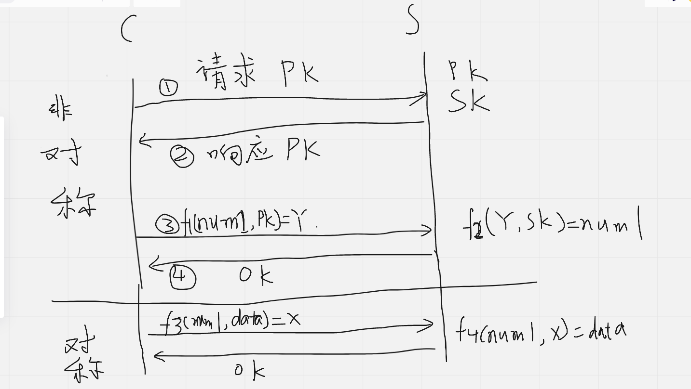
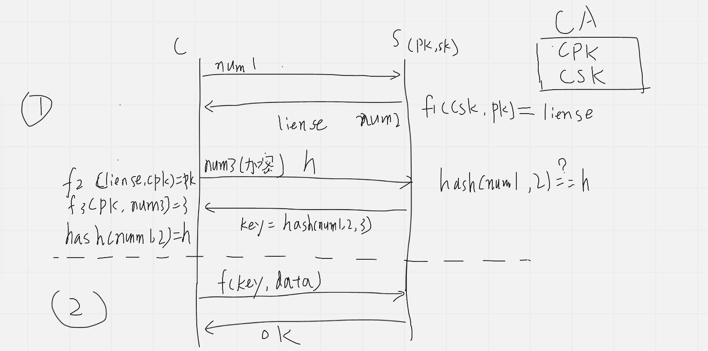

# HTTPS原理

明文传输，容易被黑客截取

## 对称加密

定义一个key，

客户端发送数据data，使用加密算法f1（key,data）=x；然后发送x

服务端接收数据x，使用解密算法f2（key,x）=data 得到原始数据，根据data响应客户端；

**问题：一旦黑客获取到这个key，那么数据传输也没有安全性可言。因此要是每个客户端一个key那也还是可以保证安全性的,但这会造成庞大的开销，所以一般协商一个key，**

## 非对称加密

定义一个公钥(pk)和私钥(sk)

因此可以公钥加密，私钥解密；f1(pk,data)=y --> f2(sk,y)=data

也可以私钥加密，公钥解密f1(sk,data)=y --> f2(pk,y)=data

客户端发送请求获取公钥

服务端返回公钥

客户端公钥加密data，f1(sk,data)=y 发送加密数据y

服务端收到数据y，使用私钥解密f2(sk,y)=data，得到data，根据data响应客户端

**问题：服务端返回响应的时候，发送数据的时候使用私钥加密，黑客可以通过公钥解密出响应结果**

## 结合对称加密+非对称加密(大概流程)

**先协商对称加密key**

客户端发送请求获取公钥

服务端返回公钥

客户端生成一个随机数，num1，然后使用公钥加密f1(pk,num1) = y

服务端收到数据y，使用私钥解密f2(sk,y)=num1，得到num1，num1就作为对称加密的key

**得到key，使用对称加密发送数据**

使用key作为对称加密发送和解析数据；f3（num1，data）=x

**好处：key是通过客户端生成的num1随机数生成的，每个key都不一样，即使接获到数据，黑客不知道对称加密的key是什么**

**问题：**

​		**假如黑客在第一步截获客户端发送获取公钥请求，然后作为中间人，给客户端自己的公钥pk1，同时再请求服务端的公钥pk。客户端以为获取到了pk，然后用黑客的pk1加密随机数num1，f1(pk1,num1) = y1发送给黑客，黑客使用自己的私钥sk1解密f2(sk1,y1)=num1，得到随机数num1，然后再拿着服务端的公钥pk加密num1，f1(pk,num1) = y，发送给服务端。服务端用自己的私钥解密得到num1，f2(sk,y)=num1。**

​		**接下来每次请求都会先使用对称加密的num1加密数据发送给黑客，黑客知道对称加密的key是多少，就可以解析，再发给服务端**

## 解决中间人问题

引入ca权威机构，公钥都往ca注册，ca认证过的公钥才是好的公钥，ca也有一个公钥（cpk）和私钥（csk），

客户端请求公钥（pk）

服务端使用ca的私钥（csk）加密公钥（pk）得到一个证书，f（csk，pk）= liense，返回给客户端

客户端获取ca机构的公钥（cpk），认证这个证书。为了安全，防止被黑客截获，ca的公钥全部写死在操作系统里面。f（cpk，liense）=pk，这样就保证了公钥是正确的而不是黑客的。

## 上述非对称加密获取密钥key阶段被称为握手，详细过程是这样的

**客户端发出请求（ClientHello）**

（1） 支持的协议版本，比如TLS 1.0版。

（2） 一个客户端生成的随机数num1，稍后用于生成"对话密钥key"。

（3） 支持的加密方法，比如RSA公钥加密。

（4） 支持的压缩方法

**服务器回应（SeverHello）**

（1） 确认使用的加密通信协议版本，比如TLS 1.0版本

（2） 一个服务器生成的随机数num2，稍后用于生成"对话密钥"key。

（3） 确认使用的加密方法，比如RSA公钥加密。

（4） 服务器证书。

**客户端回应**

​		客户端收到服务器回应以后，首先**验证服务器证书**。如果证书不是可信机构颁布、或者证书中的域名与实际域名不一致、或者证书已经过期，就会向访问者显示一个警告，由其选择是否还要继续通信。

如果正确

（1） 一个随机数num3。该随机数用服务器公钥加密。

（2） 编码改变通知，表示随后的信息都将用双方商定的加密方法和密钥发送。

（3） 客户端握手结束通知，表示客户端的握手阶段已经结束。这一项同时也是前面发送的所有内容的hash值，用来供服务器校验。

**服务器的最后回应**

用num1，num2，num3生成一个key，hash之后告诉给客户端，（因为客户端也知道num1，2，3的值，所以校验一下就可以知道是不是服务端真正返回的）

